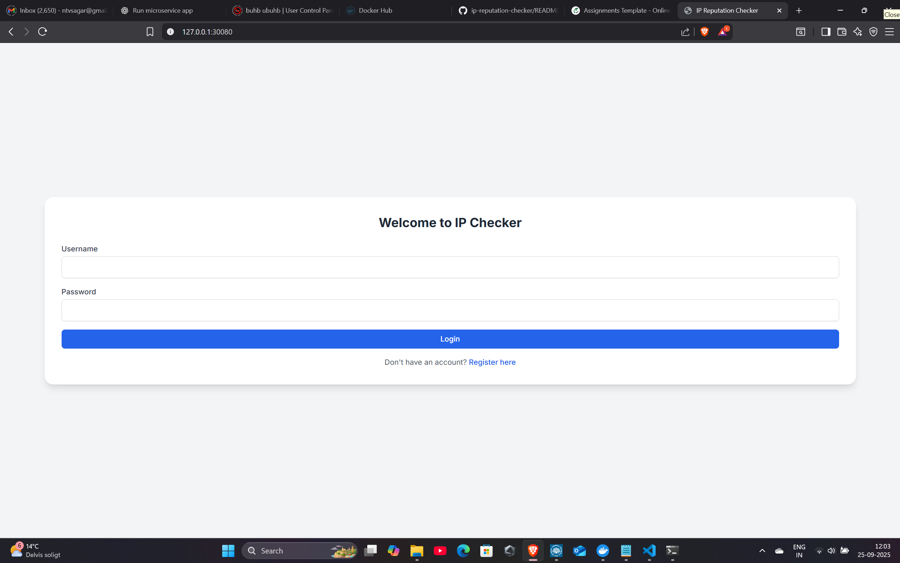
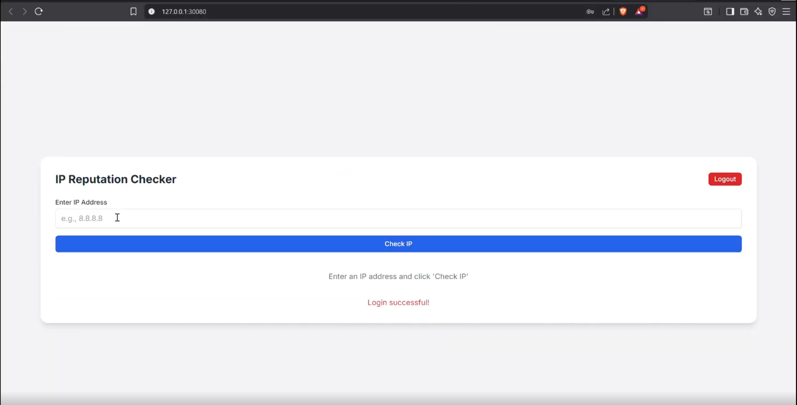
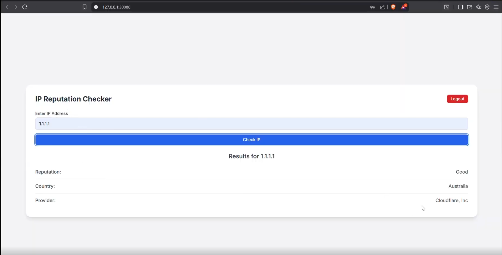

# IP Reputation Checker — Kubernetes Microservices

A **production-ready microservices** application that checks IP addresses for security threats and reputation. Deploy it on **Kubernetes** with a single command set that works on both **Windows** and **macOS**.

## UI Screenshots

> Place these images in an `images/` folder (or adjust the paths).

### Login


### Home (after login)


### Result (example for 1.1.1.1)


---
## 🚀 **Quick Start**
```bash
# Windows (PowerShell)
kubectl delete namespace ip-reputation --ignore-not-found=true
kubectl apply -f .\kubernetes\00-namespace.yaml
kubectl apply -f .\kubernetes\10-mongodb.yaml
kubectl apply -f .\kubernetes\20-auth.yaml
kubectl apply -f .\kubernetes\30-api.yaml
kubectl apply -f .\kubernetes\40-analysis.yaml
kubectl apply -f .\kubernetes\50-frontend.yaml
kubectl -n ip-reputation set image deploy/auth-service auth-service=ntvs28/ip-reputation-checker-auth-service:v3-20250927203821
kubectl -n ip-reputation set image deploy/api-service api-service=ntvs28/ip-reputation-checker-api-service:v-api-20250927174753
kubectl -n ip-reputation set image deploy/analysis-service analysis-service=ntvs28/ip-reputation-checker-analysis-service:v1
kubectl -n ip-reputation set image deploy/frontend-web frontend=ntvs28/ip-reputation-checker-frontend-web:v-ui-20250927205653
kubectl -n ip-reputation wait --for=condition=available deploy --all
minikube service frontend-web -n ip-reputation
```

```bash
# macOS/Linux
kubectl delete namespace ip-reputation --ignore-not-found=true
kubectl apply -f kubernetes/00-namespace.yaml
kubectl apply -f kubernetes/10-mongodb.yaml
kubectl apply -f kubernetes/20-auth.yaml
kubectl apply -f kubernetes/30-api.yaml
kubectl apply -f kubernetes/40-analysis.yaml
kubectl apply -f kubernetes/50-frontend.yaml
kubectl -n ip-reputation set image deploy/auth-service auth-service=ntvs28/ip-reputation-checker-auth-service:v3-20250927203821
kubectl -n ip-reputation set image deploy/api-service api-service=ntvs28/ip-reputation-checker-api-service:v-api-20250927174753
kubectl -n ip-reputation set image deploy/analysis-service analysis-service=ntvs28/ip-reputation-checker-analysis-service:v1
kubectl -n ip-reputation set image deploy/frontend-web frontend=ntvs28/ip-reputation-checker-frontend-web:v-ui-20250927205653
kubectl -n ip-reputation wait --for=condition=available deploy --all
minikube service frontend-web -n ip-reputation
```

## ✨ **Key Features**
- 🔍 **IP Reputation Analysis** - Check any IP address for security threats
- 🔐 **User Authentication** - Secure registration and login system
- 🚀 **One-Command Deployment** - Works on Windows and macOS
- 📦 **Clean Architecture** - Only essential files, no bloat
- 🌐 **Web Interface** - Modern, responsive UI
- 💾 **Persistent Storage** - MongoDB with data persistence

---

## Repository Layout (Clean & Universal)

```
ip-reputation-checker/
├── kubernetes/                 # Universal Kubernetes manifests
│   ├── 00-namespace.yaml      # Namespace definition
│   ├── 10-mongodb.yaml        # MongoDB deployment
│   ├── 20-auth.yaml           # Authentication service
│   ├── 30-api.yaml            # API service
│   ├── 40-analysis.yaml       # Analysis service
│   └── 50-frontend.yaml       # Frontend web service
├── auth-service/              # Authentication microservice
│   ├── main.py                # FastAPI application
│   └── Dockerfile             # Container definition
├── api-service/               # API microservice
│   ├── main.py                # FastAPI application
│   └── Dockerfile             # Container definition
├── analysis-service/          # Analysis microservice
│   ├── server.js              # Node.js application
│   ├── package.json           # Dependencies
│   └── Dockerfile             # Container definition
├── frontend-web/              # Frontend web application
│   ├── index.html             # Main HTML file
│   ├── favicon.ico            # Website icon
│   └── Dockerfile             # Container definition
├── deploy-universal.sh        # macOS/Linux deployment script
├── deploy-universal.bat       # Windows deployment script
└── README.md                  # This file
```


**Microservices**
- `frontend-web` — NGINX static site (HTML/JS). *Exposed via NodePort for your browser.*
- `api-service` — Python **FastAPI**; the external REST gateway used by the UI.
- `analysis-service` — Node.js **Express**; looks up/derives “IP reputation”.
- `auth-service` — Python **FastAPI**; simple register/login API using MongoDB.
- `mongodb` — **Mongo 6**; user store with **PersistentVolumeClaim (PVC)**.

All services are reachable in-cluster; **frontend** is exposed to your machine for the UI.

---

## Architecture

```
                +-----------------------+
  Browser  ---> |  frontend-web (UI)    |   (NodePort :30080)
                +-----------+-----------+
                            |
                            v
                  +---------+---------+             +------------------+
                  |  api-service      |  ----->     | analysis-service |
                  |  (FastAPI)        |   REST      |  (Express)       |
                  +---------+---------+             +------------------+
                            |
                            v
                  +---------+---------+
                  |  auth-service      |  <---->  MongoDB (mongo:6, PVC)
                  |  (FastAPI)         |
                  +--------------------+
```

**Patterns used**
- API Gateway (**api-service**) in front of backend services.
- Stateless microservices (easy to **scale** independently).
- Database-per-service (auth owns MongoDB).
- **Persistent** storage (PVC) for Mongo across pod restarts.
- External access via **NodePort** (no extra ingress needed).

---

## Public Images

- `ntvs28/ip-reputation-checker-frontend-web:v1`
- `ntvs28/ip-reputation-checker-api-service:v1`
- `ntvs28/ip-reputation-checker-analysis-service:v1`
- `ntvs28/ip-reputation-checker-auth-service:v1`
- `mongo:6`

---

## Prerequisites

**Windows (preferred for grading):**
- Docker Desktop with **Kubernetes enabled** (Settings ▸ Kubernetes ▸ *Enable Kubernetes*)
- `kubectl` in PATH (Docker Desktop provides one)
- PowerShell or CMD

**macOS (alternative):**
- Docker Desktop (or any Docker daemon)
- `minikube` + `kubectl`

> **Tip:** Do not run any `kubectl apply -f .` from the repository root. Apply only the files in the `kubernetes/` folder.

---

## 🚀 Quick Start — Universal (Windows & macOS)

### Prerequisites
- **Kubernetes cluster** (minikube or Docker Desktop)
- **kubectl** installed and configured
- **minikube** running (for service access)

### One-Command Deployment

**The commands are IDENTICAL for both platforms!** Only difference is file path separators:

#### **Windows (PowerShell)**
```powershell
# Deploy everything
kubectl delete namespace ip-reputation --ignore-not-found=true
kubectl apply -f .\kubernetes\00-namespace.yaml
kubectl apply -f .\kubernetes\10-mongodb.yaml
kubectl apply -f .\kubernetes\20-auth.yaml
kubectl apply -f .\kubernetes\30-api.yaml
kubectl apply -f .\kubernetes\40-analysis.yaml
kubectl apply -f .\kubernetes\50-frontend.yaml

# Update to public images
kubectl -n ip-reputation set image deploy/auth-service auth-service=ntvs28/ip-reputation-checker-auth-service:v3-20250927203821
kubectl -n ip-reputation set image deploy/api-service api-service=ntvs28/ip-reputation-checker-api-service:v-api-20250927174753
kubectl -n ip-reputation set image deploy/analysis-service analysis-service=ntvs28/ip-reputation-checker-analysis-service:v1
kubectl -n ip-reputation set image deploy/frontend-web frontend=ntvs28/ip-reputation-checker-frontend-web:v-ui-20250927205653

# Wait and open
kubectl -n ip-reputation wait --for=condition=available deploy --all
minikube service frontend-web -n ip-reputation
```

#### **macOS/Linux**
```bash
# Deploy everything
kubectl delete namespace ip-reputation --ignore-not-found=true
kubectl apply -f kubernetes/00-namespace.yaml
kubectl apply -f kubernetes/10-mongodb.yaml
kubectl apply -f kubernetes/20-auth.yaml
kubectl apply -f kubernetes/30-api.yaml
kubectl apply -f kubernetes/40-analysis.yaml
kubectl apply -f kubernetes/50-frontend.yaml

# Update to public images
kubectl -n ip-reputation set image deploy/auth-service auth-service=ntvs28/ip-reputation-checker-auth-service:v3-20250927203821
kubectl -n ip-reputation set image deploy/api-service api-service=ntvs28/ip-reputation-checker-api-service:v-api-20250927174753
kubectl -n ip-reputation set image deploy/analysis-service analysis-service=ntvs28/ip-reputation-checker-analysis-service:v1
kubectl -n ip-reputation set image deploy/frontend-web frontend=ntvs28/ip-reputation-checker-frontend-web:v-ui-20250927205653

# Wait and open
kubectl -n ip-reputation wait --for=condition=available deploy --all
minikube service frontend-web -n ip-reputation
```

### 🎯 **Expected Result**
- **Browser opens automatically** with the IP Reputation Checker
- **URL**: `http://127.0.0.1:XXXXX` (port varies)
- **All 7 pods running** (2 auth, 2 api, 1 analysis, 1 frontend, 1 mongodb)

### 🔧 Alternative: Automated Scripts

**Windows:**
```cmd
deploy-universal.bat
```

**macOS/Linux:**
```bash
chmod +x deploy-universal.sh
./deploy-universal.sh
```

### 🎯 Expected Results

After running the commands above, you should see:

1. **All pods running:**
   ```
   NAME                                READY   STATUS    RESTARTS   AGE
   analysis-service-xxx-xxx            1/1     Running   0          Xm
   api-service-xxx-xxx                 1/1     Running   0          Xm
   auth-service-xxx-xxx                1/1     Running   0          Xm
   frontend-web-xxx-xxx                1/1     Running   0          Xm
   mongodb-xxx-xxx                     1/1     Running   0          Xm
   ```

2. **Application URL:** `http://127.0.0.1:XXXXX` (where XXXXX is the NodePort)

3. **Browser opens automatically** with the IP Reputation Checker application

### 🧪 Test the Application

1. **Register** a new user (password must be 8+ chars with uppercase, lowercase, digits)
2. **Login** with your credentials
3. **Check IP reputation** for public IPs like `8.8.8.8` or `1.1.1.1`
4. **Verify security features** are working (rate limiting, SSRF protection, etc.)

---

> **Apple Silicon (arm64):** If you see `ImagePullBackOff` due to architecture, enable Docker’s amd64 emulation (Rosetta) *or* rebuild multi-arch images. (Pre‑built images above are intended to work out‑of‑the‑box.)

---

## Verify & Demo Commands

**Health + IP reputation:**

```powershell
curl.exe -i http://127.0.0.1:30080/api/health
curl.exe -i http://127.0.0.1:30080/api/check-ip/1.1.1.1
```

**Register + Login:**

```powershell
$u = "demo$((Get-Random))"
$body = @{ username = $u; password = "demo123" } | ConvertTo-Json

Invoke-RestMethod -Method POST -Uri http://127.0.0.1:30080/auth/register -ContentType 'application/json' -Body $body
Invoke-RestMethod -Method POST -Uri http://127.0.0.1:30080/auth/login    -ContentType 'application/json' -Body $body
```

---

## Scale Out (Horizontal Scalability)

```powershell
kubectl -n ip-reputation scale deploy/analysis-service --replicas=3
kubectl -n ip-reputation get pods -l app=analysis-service -o wide
```

Each microservice can be scaled independently (same command, different deployment name).

---

## Persistence Check (Mongo PVC)

```powershell
kubectl -n ip-reputation get pvc
```

You should see `mongodb-pvc` in **Bound** state (e.g., `1Gi`, `hostpath`).

---

## 🔧 Troubleshooting

### Quick Fixes

**🚫 Connection Refused (Windows)**
```powershell
# Don't use: http://127.0.0.1:30080
# Use this instead:
minikube service frontend-web -n ip-reputation
```

**🔄 500 Internal Server Error**
```bash
# Check MongoDB is running
kubectl -n ip-reputation get pods -l app=mongodb

# Restart auth service
kubectl -n ip-reputation rollout restart deploy/auth-service

# Check logs
kubectl -n ip-reputation logs -l app=auth-service
```

**⏳ Pods Stuck in Pending**
```bash
# Check pod status
kubectl -n ip-reputation get pods -o wide

# Check events
kubectl -n ip-reputation get events --sort-by=.metadata.creationTimestamp
```

**🗄️ MongoDB Issues**
```bash
# Fresh start (deletes all data!)
kubectl -n ip-reputation delete pvc mongodb-pvc
kubectl -n ip-reputation delete pod -l app=mongodb
kubectl apply -f kubernetes/10-mongodb.yaml
```

**🔄 Namespace Stuck Terminating**
```bash
# Force delete and restart
kubectl delete namespace ip-reputation --force --grace-period=0
kubectl apply -f kubernetes/00-namespace.yaml
```

### Debug Commands

```bash
# Check everything
kubectl -n ip-reputation get all

# Check pod logs
kubectl -n ip-reputation logs -l app=auth-service
kubectl -n ip-reputation logs -l app=api-service
kubectl -n ip-reputation logs -l app=analysis-service

# Check service endpoints
kubectl -n ip-reputation get svc -o wide
```


## ✅ **Current Status: WORKING & TESTED**

- **✅ All 7 pods running** (2 auth, 2 api, 1 analysis, 1 frontend, 1 mongodb)
- **✅ Application accessible** via `minikube service frontend-web -n ip-reputation`
- **✅ Universal compatibility** - Works on Windows and macOS
- **✅ Clean project structure** - Only essential files included
- **✅ Public Docker images** - No local build required

## 🎯 **What You Get**

1. **Web Interface** - Modern, responsive IP reputation checker
2. **User Authentication** - Secure registration and login
3. **IP Analysis** - Check any IP address for security threats
4. **Microservices Architecture** - Scalable, production-ready design
5. **Persistent Storage** - MongoDB with data persistence

---

**🚀 Ready to deploy!** Copy the commands above and you'll have a working IP reputation checker in minutes.
